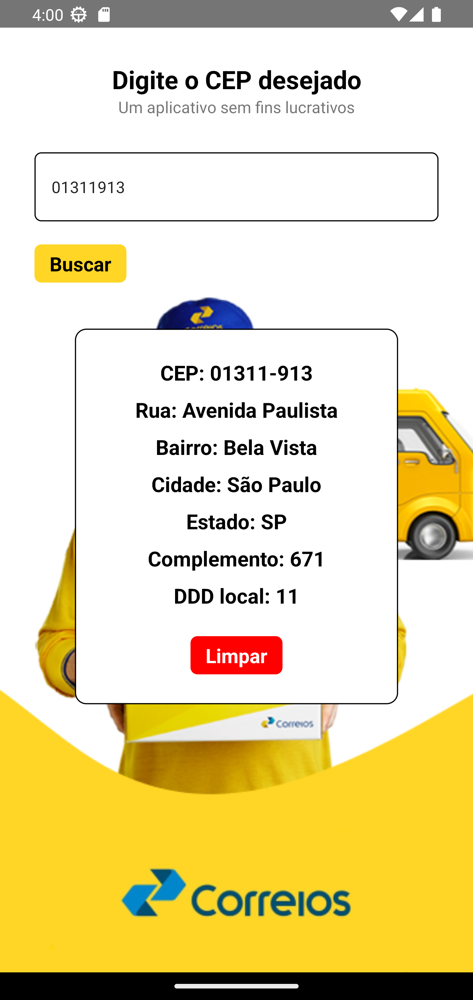

## Buscador de CEP

Aplicativo Android desenvolvido em ReactNative.

O Buscador de CEP é um aplicativo inteligente e eficiente que permite realizar buscas de CEP instantâneas e precisas entre diferentes regiões do Brasil. Com uma interface intuitiva e fácil de usar.

Foi utilizado:

- https://viacep.com.br - API dos correios para buscar o CEP.

Melhorias no designer

 
 
 

